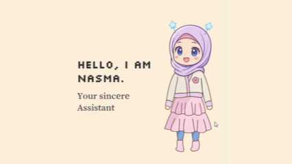
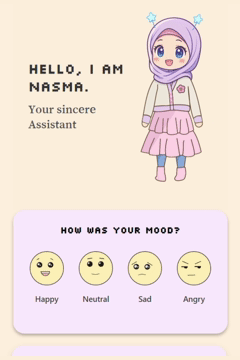
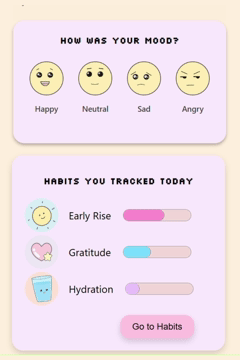
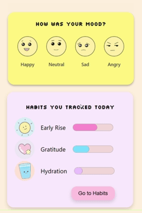
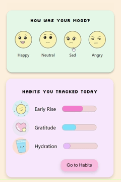
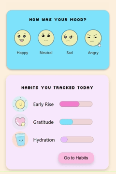
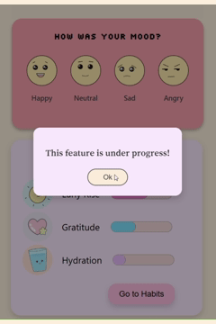

# Nasma Assist 🌼✨  

My project is a react friendly web application with a cute assistant named Nasma who helps you track your moods and build good habits.💖  

## visual overview 🍓  

  

### App overview 🎬

  
 
---

## languages 💻  
- HTML  
- CSS  
- JavaScript  

---

## Libraries ⭐  
- ReactJs  
- Framer-Motion  

---

## Features 🌟  
- Choose your daily mood with a colorful panel that changes its color.🎨  
- Enjoy interactive sounds matching your chosen mood.🔔  
- Get a reaction from Nasma through a cute popup window.🌼 
- Ask Nasma for a suggestion (feature under progress)💡 

**Planned future features include:**  
- Habit tracking and planning with Nasma.🌱  
- Goal setting to stay on track.🎯  
- Calendar and overview to plan ahead and evaluate progress.📆

---

## Mood Features Example 🌟

  

  

  

 

## Planned future features 🛠️

  

## Managing state 💫  
Currently managed with React state, with room for future improvements.🌻  

---

## Last note 🌼  
This app is still in progress, but you can already feel the warm company of Nasma and a glimpse of her future features.🍒✨  

For more details about the planned future features, check the Figma design linked below.🎀  

*(Note: the design is still a work in progress and not fully complete.)*

👉 [View on Figma](https://www.figma.com/design/hkWt1ZIMZmkFJYX1GpFU5C/Mood-Habit-Tracker-App?node-id=0-1&t=SlcD5zXEQhc5NcYC-1)

---

Thanks for reading ♡ ⋆｡˚  
